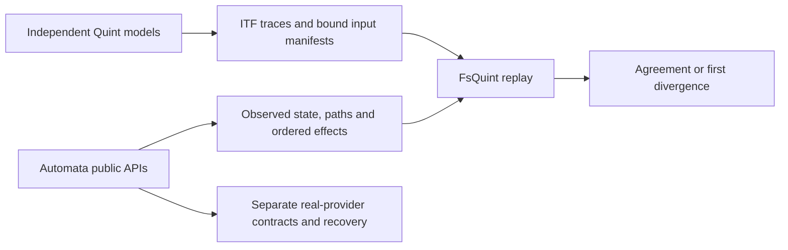

# Checking Automata implementations with Quint and FsQuint

The integration is implemented as reproducible examples, independent models and native
provider qualification. Quint describes and explores allowed behavior; Automata executes
F# charts and durable protocols; FsQuint reads genuine ITF traces and compares observations
from an independently initialized implementation. No new public adapter package is required.



## Start with committed traces

From the repository root, using SDK 10.0.401:

```sh
dotnet pack src/FsQuint/FsQuint.fsproj -c Release -o artifacts/packages
python3 examples/AutomataReplay/check.py
```

This restores an isolated NuGet consumer and runs package characterization, application
conformance, resolver semantics, correction planning and controlled runtime schedules.
No Quint executable or database is required for fixture replay. Restore needs network
access to NuGet; “offline replay” describes execution after dependencies are available.
Expected negative controls report divergence and count as success only when they fail
at the required boundary. An unexpected divergence or malformed fixture fails the check.

The [approval chart](../examples/AutomataReplay/Approval.fs) shows hierarchical transitions,
authorization refusals, terminal boundaries and ordered effects. The
[turnstile](../examples/AutomataReplay/Turnstile.fs) and
[bounded queue](../examples/BoundedQueue/Program.fs) reuse the same
[input-only helper](../examples/Shared/PureReplay.fs), demonstrating which part belongs to
FsQuint consumers rather than Automata-specific core code.

## Regenerate and check the models

```sh
bash eng/provision-quint.sh /tmp/fsquint-quint-tools
export QUINT_BIN=/tmp/fsquint-quint-tools/quint
export QUINT_HOME=/tmp/fsquint-quint-tools/home
bash eng/check.sh
```

Use a fresh destination for provisioning. This adds pinned Quint typechecking, witnesses,
fixed-seed simulation, fixture regeneration and required coverage checks. Regeneration
compares semantic states and preserves raw bytes for unchanged committed fixtures; it
refuses a changed regression trace rather than silently replacing expected behavior.
The [generation script](../examples/AutomataReplay/regenerate.py) exposes explicit
`--write` for deliberately adding reviewed new fixtures.

The resolver's [bounded-check evidence](../examples/AutomataReplay/fixtures/resolver/bounded-check.json)
records a separate completed Apalache check through two transitions. Ordinary CI does not
reinstall or rerun that verifier, and sampled invariants are not described as exhaustive proofs.

## Add your own chart

1. Write an independent model of the domain inputs, outcomes and observable effects. Keep
   model inputs explicit, especially when several events lead to the same state.
2. Build the actual chart from its real initial state. Give constructor/reducer callbacks
   input data only; expected model state belongs exclusively to the comparison engine.
3. Define a versioned projection that includes all behavior relevant to the claim. Ordered
   effects and resolver paths matter even when final domain state agrees.
4. Bind every input to an ITF trace step with a strict manifest. Validate digests, operation
   identities and cardinality before creating a runtime or performing effects.
5. Seed implementation and projection defects. Keep the resulting failure trace, identities,
   first divergent step and expected/actual observations for reproduction.

The helper is example source for small synchronous reducers. An asynchronous durable
consumer should use an appropriate observation boundary rather than copying its shape
without accounting for scheduling, cancellation and partial effects.

## Check runtime and storage separately

[Controlled protocol schedules](../examples/AutomataReplay/PROTOCOL.md) exercise the real
processor and dispatcher with a deterministic test store. They cover stale fencing,
ambiguous commit, acknowledgment loss, cancellation, duplicate submission, FIFO/dead-letter
progress and rejection. Seven schedules run twice; broken fencing, duplicate finalization
and missing destination deduplication are detected. The comparison is between completed
schedule summaries, not a claim of refinement at every internal instruction.

For native stores, follow [AutomataProviders](../examples/AutomataProviders/README.md).
Its isolated Linux runner executes 118 SQLite and 152 PostgreSQL upstream contracts,
then original public-API worker-kill recovery checks and a corrected-history restart
witness. PostgreSQL requires the pinned 19beta3 temporal feature set, PGMQ and pg_cron.
SQLite lacks temporal correction; its explicit refusal/entity-release behavior is tested.
These provider claims do not include power failure, replication or arbitrary histories.

## Upgrade and support boundaries

Automata 0.5.0, Quint 0.32.0, evaluator 0.6.0 and the dependency/archive identities are
pinned in the examples. A changed chart fingerprint is useful provenance but is not a
behavioral checksum: closures can change without changing it. Run the old corpus, seeded
mutations and candidate regeneration before accepting an upgrade. Change the profile
explicitly when semantics change; do not regenerate away an unexplained disagreement.

The repository owns these examples and integration profiles. Upstream projects retain
their own semantics and release authority; no upstream endorsement or adoption is claimed.
FsQuint's public core/tooling API and dependency graph remain unchanged. No adapter package
or application deployment is included. The [optional expansion decisions](roadmaps/2026-09-27-quint-automata-expansion-decisions.md)
explain why exporters, finite callback exploration, a shared IR and historical validation
were not selected without a consumer and maintenance owner.

The [design and completed roadmap](roadmaps/2026-09-27-090245-quint-automata-integration.md)
contains the prior-art research and stage-by-stage delivery evidence.
