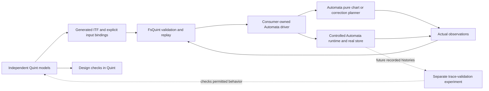
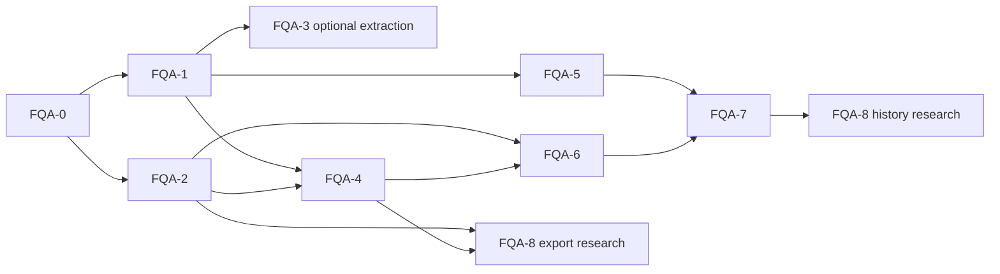

# Quint, Automata and FsQuint integration design

Created: **2026-09-27T09:02:45Z** (2026-09-27 11:02:45 Europe/Vienna).

Research cutoff: **2026-09-27**.

Feature identity: **FQA-01**.

Status: **FQA-0–FQA-4 delivered; FQA-5 pure correction conformance implemented, awaiting delivery; durable runtime/providers remain unqualified**.

Planning owner: FsQuint maintainers. Proposed upstream work requires Automata or Quint maintainer acceptance.

Integrate these three projects through independently authored models, explicit inputs and observable results. Quint specifies and explores behavior; Automata executes domain statecharts and durable commands; FsQuint connects selected model executions to F# implementations. Start with a database-free conformance example and a separate model of Automata's resolver semantics. Extend to correction planning and controlled durable-runtime tests after those boundaries are qualified. Treat chart export, shared intermediate representations and implementation-history validation as distinct, gated opportunities: they answer different questions and require different evidence.

This document records a design decision, source inspection and online research. Merging it approves the recorded direction, not claims of correctness, upstream commitments, implementation completion or a package release. It complements the [FsQuint scope and ownership roadmap](fsquint.md), [compatibility policy](../compatibility.md) and [usage guide](../usage.md).

## 1. Decision and scope

The integration has three equally important relationships:

| Relationship | Questions it can answer | Initial deliverable |
|---|---|---|
| Quint ↔ Automata | Is the workflow design safe? Are statechart resolution rules coherent? Do lease, commit and correction protocols preserve their invariants? | Independent domain models and a bounded resolver-semantics model, runnable with Quint alone |
| Automata ↔ FsQuint | Does the actual F# chart or runtime produce the state, actions and outcomes required by a selected scenario? | A replay adapter in an example/test project |
| FsQuint ↔ Quint | Are trace values, chosen inputs, source bindings, tool identities and limits preserved correctly? | A versioned scenario-binding convention and genuine trace fixtures |

The first milestone must not require changes in all three repositories. Models and a small Automata-consuming example can live in FsQuint initially. Models intended to define Automata's own library semantics should eventually be owned alongside Automata, if its maintainers accept them. Quint should receive only reusable tooling requests or fixtures, not application-specific policy.

We will preserve FsQuint's runtime-neutral core. Neither Automata nor a database becomes a dependency of `FsQuint` or `FsQuint.Tooling`. An optional adapter package is a later decision supported by two distinct consumers. We will not import a workflow engine into FsQuint or replace Automata's correction algorithm with FsQuint's test replay engine.

## 2. Inspected baseline and actual gaps

### 2.1 Reproducible inspection

| Project | Baseline inspected | What this establishes |
|---|---|---|
| FsQuint | [`73a7acb`](https://github.com/FS-GG/FsQuint/tree/73a7acb); source API remains on package version 0.1.0 | Current replay, raw ITF and tooling boundaries; no Automata adapter |
| Automata | [`03c3282f25888a32d36e53fa708f0342c328ccfc`](https://github.com/byzantine-systems/automata/tree/03c3282f25888a32d36e53fa708f0342c328ccfc); repository version 0.5.0, net10.0 | Actual F# resolver, runtime/correction seams, store implementations and tests; this is not a verified NuGet availability claim |
| Quint | FsQuint-qualified CLI 0.32.0 and Rust evaluator 0.6.0; current upstream documentation also researched | Existing supported execution baseline, distinct from features described by newer upstream docs |

Automata was cloned read-only for analysis outside this repository. This research did not run its test suite, build an integration or verify its published package contents. Source-derived behavior below is a characterization target, not a newly established guarantee.

### 2.2 FsQuint already supplies most of the replay mechanism

The [replay contract](../../src/FsQuint/Replay.fsi) has `Initialize`, `Apply`, `Observe` and `Cleanup`. `Replay.run` validates the replay envelope before initialization, compares the initial observation, applies each step once and reports the first difference. Cleanup failures are retained separately. Cancellation and deadlines are cooperative; cleanup uses a fresh, uncancelled token, so a stuck callback can still require process isolation.

Important constraints from the [types](../../src/FsQuint/ReplayTypes.fsi), [raw decoder](../../src/FsQuint/Itf.fsi) and [tooling API](../../src/FsQuint.Tooling/Tooling.fsi):

- `QuintReplayStep` contains an action string, source binding and expected state, but no separate typed event payload or recorded scheduling choice.
- `Apply` receives that complete step. A careless driver could read `Expected` and make a failing implementation look correct. An integration wrapper should expose only decoded input to domain code.
- Raw `ItfValue` supports maps, tuples and arbitrary integers. Schema-v1 `QuintReplayValue` has a smaller value vocabulary. They are not interchangeable representations.
- Raw ITF decoding supplies states, not a generic action-attribution mechanism. Actions must come from explicit instrumentation or a bound scenario manifest.
- Tooling currently exposes `Typecheck`, `Test` and sampled `Run`. It has no public `Verify` case, generic trace-generation configuration or bounded-verification result type. Running a simulation is not model checking.
- Replay diagnostics currently identify a differing top-level binding, not an arbitrarily deep value path. An adapter can attach richer explanatory artifacts without promising that core behavior already exists.

The [queue example](../../examples/BoundedQueue/Program.fs) demonstrates explicit scenario bindings and negative controls. Its small string commands are appropriate for that example; they are not a sufficient general event-serialization design.

### 2.3 Automata has unusually useful testing seams

The inspected library separates chart resolution, transition drafts, durable finalization and action delivery. `Chart.resolve` returns the next state plus handler, exit path, entry path and ordered actions. These are better conformance observations than the next state alone. See the pinned [resolution types](https://github.com/byzantine-systems/automata/blob/03c3282f25888a32d36e53fa708f0342c328ccfc/src/ByzantineSystems.Automata.Core/Resolution.fs).

Its [rules](https://github.com/byzantine-systems/automata/blob/03c3282f25888a32d36e53fa708f0342c328ccfc/src/ByzantineSystems.Automata.Core/Rules.fs) contain opaque F# functions. `RuleKind` preserves combinator shape, but not arbitrary predicates or transforms. `Chart.fingerprint` is consequently structural, not a hash of behavior. The [chart implementation](https://github.com/byzantine-systems/automata/blob/03c3282f25888a32d36e53fa708f0342c328ccfc/src/ByzantineSystems.Automata.Core/Chart.fs) explicitly documents that limitation.

Runtime source provides two additional pure seams: [`Draft.ofResolution`](https://github.com/byzantine-systems/automata/blob/03c3282f25888a32d36e53fa708f0342c328ccfc/src/ByzantineSystems.Automata.Runtime/Draft.fs) and historical [`Replay.plan`](https://github.com/byzantine-systems/automata/blob/03c3282f25888a32d36e53fa708f0342c328ccfc/src/ByzantineSystems.Automata.Runtime/Replay.fs). The latter can be checked before introducing database scheduling.

Both PostgreSQL and SQLite implementations exist in the inspected source tree. Qualify them separately; the README package summary is not an exhaustive provider compatibility matrix. Do not infer cross-provider temporal or concurrency equivalence from their shared interfaces. [Provider source tree](https://github.com/byzantine-systems/automata/tree/03c3282f25888a32d36e53fa708f0342c328ccfc/src)

## 3. Prior art and reported experience

Research covered model-based testing, statechart traversal and semantics, formal design checking, controlled concurrency, deterministic simulation and recorded-trace validation. The table separates authors' reports from our proposed applications. It is not a comparative benchmark. Documentation establishes capability, not industrial success; case studies establish experience in their reported scope, not universal effectiveness.

| Prior art and evidence | Reported result or capability | Experience, limitation and implication here |
|---|---|---|
| **Quint Connect**, maintainers' [launch account](https://quint.sh/posts/quint_connect) and [Rust library](https://github.com/quint-co/quint-connect) | Explicit application-state projection and replay of selected actions/choices; reproducible traces and CI integration | Glue code was the adoption cost. The team tightened interfaces after generated adapters took undesirable shortcuts. Expose narrow input-only callbacks; make driver failures actionable. |
| **Emerald**, [February 2026 experience report](https://quint.sh/posts/quint_connect_emerald) | Authors report roughly 80% application-layer coverage and a completed-stream leak found through MBT. They modeled the application boundary rather than the whole consensus/execution stack. | Scope reduction helped. Long failures were converted to smaller deterministic runs. This supports focused models and a durable regression corpus, not an 80% coverage target for our unrelated project. |
| **Emerald's implementation and model fixes**, merged [PR #178](https://github.com/informalsystems/emerald/pull/178) and [PR #202](https://github.com/informalsystems/emerald/pull/202) | #178 fixes pruning after stream completion. #202 adds a missing synchronization phase to the model following a failing scenario. | A divergence may expose an implementation bug **or a model defect**. Preserve both artifacts and triage before changing expected results. |
| **MongoDB eXtreme Modelling**, [VLDB 2020 paper](https://vldb.org/pvldb/vol13/p1346-davis.pdf) | Test generation succeeded for Realm Sync; server trace-checking was judged impractical in that experiment. The server trace-checking effort totaled about ten weeks. | Concurrency, abstraction mismatch and instrumentation costs defeated cheap reuse. Do not make production-history validation a prerequisite for the useful pure adapter. |
| **MongoDB retrospective**, [June 2025 account](https://www.mongodb.com/company/blog/engineering/conformance-checking-at-mongodb-testing-our-code-matches-our-tla-specs) | Contrasts generated tests with observed-trace checking and discusses subsequent progress | A reconstructed global state can invent atomicity the implementation never had. Use several small models, record real commit boundaries, and treat trace validation as its own project. |
| **AWS TLA+**, [authors' experience paper](https://lamport.azurewebsites.net/tla/formal-methods-amazon.pdf) | Found design defects in storage/replication systems, including scenarios requiring 35 steps, and supported optimizations | The paper also records a missed liveness bug where liveness was not checked. Specify progress assumptions explicitly; short safety samples do not establish eventual completion. |
| **Microsoft Coyote**, [Azure PoolManager study, SoCC 2021](https://www.microsoft.com/en-us/research/uploads/prod/2021/09/poolmanager-coyote.pdf) | Authors report hundreds of development bugs found, reproducible failures and adoption in multiple Azure services | Success combined controllable nondeterminism, specifications and daily testing. Bugs outside tested features remained possible. An optional .NET scheduler experiment is useful only after its control boundary is measured. |
| **FoundationDB**, [SIGMOD 2021 paper, §4](https://www.foundationdb.org/files/fdb-paper.pdf) | Production code runs with deterministic simulated time, faults and I/O, enabling repeatable rare failures | The authors explicitly identify limits around performance, external dependencies and misunderstood operating-system contracts. A seeded test alone is not deterministic simulation; real-store tests remain necessary. |
| **Stateright**, [project](https://github.com/stateright/stateright) and [TLA+ comparison](https://www.stateright.rs/comparison-with-tlaplus.html) | Combines Rust implementation and model exploration; actor examples can also execute on a network | Reusing executable logic narrows translation gaps but adopts a specific execution model. Automata's pure resolver is a useful analogous boundary; it does not make its whole runtime model-checkable. This is architectural precedent, not an Automata adoption report. |
| **XState/Stately**, [graph and path documentation](https://stately.ai/docs/graph) | Generates shortest/simple paths and test models from executable state machines | Useful precedent for coverage targets and scenario visualization. Chart-derived tests exercise structure; independent properties are still needed to detect a mistaken chart design. No quantified field outcome is assumed here. |
| **Quviq QuickCheck**, [state-machine documentation](https://www.quviq.com/documentation/eqc/eqc_fsm.html) and [specification-testing paper](https://www.cs.utexas.edu/~hunt/fmcad/FMCAD11/papers/inv8.pdf) | Stateful command testing, transition weighting and reduction of failing examples | Check preconditions and command distributions rather than counting tests alone. Generate refusal cases deliberately rather than filtering away every invalid operation. |
| **FsCheck and Hypothesis**, [FsCheck stateful guide](https://fscheck.github.io/FsCheck/StatefulTestingNew.html) and [Hypothesis stateful guide](https://hypothesis.readthedocs.io/en/latest/stateful.html) | Model-based operations, generated values reused across steps and shrinking; FsCheck labels its newer API experimental | Use these as complementary input/codec testing tools. Immutable model snapshots matter during shrinking. Do not make FsQuint's public API depend on an experimental test-framework API. |
| **Jepsen/Elle**, [PostgreSQL 12.3 investigation](https://jepsen.io/analyses/postgresql-12.3) and [Elle](https://github.com/jepsen-io/elle) | The investigation found anomalous serializable histories in the tested PostgreSQL configuration; Elle checks transactional histories | Client behavior, driver behavior and database isolation all matter. A pure inbox model is insufficient evidence for an SQL provider. This historical report is not a claim about current PostgreSQL versions. |
| **SCXML**, [W3C recommendation](https://www.w3.org/TR/scxml/) | Explicit transition-selection, hierarchy and execution semantics, with a conformance suite | Borrow the discipline of a semantic test matrix. Do not label Automata SCXML-compatible or import parallel/history/eventless behavior that its inspected API does not express. |
| **TLC trace validation**, [tool-community documentation](https://docs.tlapl.us/using:tlc:trace_validation) | Checks recorded implementation behavior against a specification | Relevant to the reverse direction, but not an existing FsQuint capability or a promise of equivalent support in pinned Quint. |

### 3.1 Conclusions supported by the research

Our synthesis is to keep the trusted adapter small, test its projections independently and preserve failures as explicit scenarios. Prefer a model at a useful application boundary over a duplicate of the full implementation. Separate control of execution from observation of execution. Keep real dependency tests alongside simulated tests. These are design choices informed by the sources above, not reported results for this integration.

The search did not establish an existing supported Quint–Automata integration or a public industrial experience report for this particular pairing. We therefore should not claim compatibility or savings from the first example. We also do not use stars, generated documentation, or marketing coverage language as qualification evidence.

## 4. Architecture and ownership



Arrows show data flow. There is no production dependency from Automata to FsQuint in this design. An Automata test project can depend on FsQuint without adding it to deployed machines. Pure Quint design checks remain useful without FsQuint or .NET.

| Artifact or responsibility | Proposed owner | Boundary |
|---|---|---|
| Domain model, invariants, event vocabulary, allowed observations | Application/example owner | Independent review against requirements |
| Resolver semantics model and library conformance corpus | Initially integration example; proposed Automata ownership | Automata maintainers decide intended behavior when implementation and model disagree |
| ITF decoding, fingerprints, generic replay and diagnostics | FsQuint | No domain transition rules |
| Scenario decoder, typed input manifest, model/implementation projection | Consumer adapter | Explicitly versioned and negatively tested |
| Trace generation and solver invocation | Quint tools, provisioned by the caller | Backend-specific qualification and outcomes |
| Database fixtures, scheduling barriers, fault injection | Runtime/provider test project | Not implemented inside generic replay |
| Optional reusable Automata adapter | Downstream package, owner to be selected at FQA-3 | References FsQuint and Automata.Core; no mandatory store |

The minimal distribution is an example and committed traces. Proposed layout:

```text
examples/AutomataReplay/
  README.md
  AutomataReplay.fsproj
  Chart.fs
  Driver.fs
  Projection.fs
  Program.fs
  models/approval.qnt
  scenarios/                 # authored scenarios and typed input manifests
  fixtures/                  # immutable ITF, bindings and provenance
  check.sh
```

Library-semantics models and runtime experiments should be separate directories/projects as they grow. The example must replay committed fixtures without Quint installed. Regeneration is an explicit operation with tool pins and reviewable diffs.

## 5. Direct Quint ↔ Automata design possibilities

### 5.1 Independent application models — adopt first

Write the approval workflow requirements in Quint and implement them with Automata. Model approval authorization, cancellation, terminal outcomes and emitted notices. Explore legal and refused events. A model transition represents one submitted domain event and its result, including refusal; a refusal can leave domain state unchanged while updating an explicit outcome observation.

Use multiple entities only when the requirement involves their interaction. Model shared resources and messaging explicitly. A hierarchy within one chart is not concurrency between multiple machines. Separating domain, resolver and inbox models keeps state spaces understandable and avoids making every domain test explore database leases.

This direct relationship already adds value without FsQuint: a team can evaluate a proposed workflow, produce witness scenarios and review counterexamples before writing F#.

The first example should make the abstraction concrete:

| Model component | Proposed bounded representation | Requirement to check |
|---|---|---|
| Document | One document, later two for independence tests | Events affect only their addressed document |
| Phase | Draft, review/pending, review/approved, published, cancelled | Publication requires prior approval; cancellation is terminal at the application/runtime boundary |
| Actors | Author and authorized reviewer, with explicit identity on events | The author cannot self-approve |
| Inputs | Submit, approve(actor), publish, cancel, remind | Refused inputs are represented rather than removed by generator preconditions |
| Outputs | Ordered audit/notification action records | Exactly the intended action sequence for each resolution, including state-preserving operations |
| Last result | Success or typed refusal | Refusal preserves domain state and emits no success notification |

A witness can submit, attempt self-approval (refused), remind (internal action), approve as the reviewer, and publish. A separate cancelled scenario submits another event after termination. The independent model supplies expected outcomes; the driver supplies those exact inputs to Automata and observes results. A guard mutation accepting self-approval must diverge at that input. A notification-order mutation must diverge even if the final phase is correct. These are planned executable acceptance scenarios, not fixtures generated in this design change.

For deterministic pure transitions, the obligation at each tested step is that projecting the implementation's actual result for input `e` equals the model result for `e`, assuming the previous states correspond. Check the initial correspondence separately. For a nondeterministic specification, the general obligation is membership in the allowed result relation; strict replay of one result is appropriate only when the relevant choices are controlled. No finite set of successful examples establishes this obligation universally.

### 5.2 Model Automata's resolver semantics — adopt as a separate suite

A finite Quint model can describe a validated tree, ordered rule tables, finite state data, input events and abstract callback results. Check hierarchy paths, precedence, refusals and action ordering. Instantiate small charts in F# and compare resolver output using FsQuint. The model should express rules mathematically and independently; translating the F# implementation line by line would preserve its mistakes.

The initial semantic profile must explicitly characterize these cases:

| Case | Inspected behavior to characterize | Required distinguishing test |
|---|---|---|
| Event search | Leaf-to-root search; rules considered in declaration order | Both child and ancestor can handle the same event |
| Guard wrapper | A failed guard stops search; the wrapper evaluates its guard before invoking the wrapped rule | False guard around a rule whose event predicate would not match |
| Domain refusal | A matched fallible rule can reject; no fallback search | Later rule/parent could otherwise accept |
| Internal transition | State unchanged; only rule actions, no exit/entry paths | Compare with an external self-transition |
| External self-transition | Exit/re-entry includes the handling chain | Same leaf handled locally versus by an ancestor |
| Compound target | Follow the declared initial path and check classifier agreement | Transform returns data classifying to the wrong leaf |
| Ancestor target | Exit/re-entry includes the target ancestor | Differentiate from ordinary least-common-ancestor traversal |
| Callback ordering/data | Exit callbacks see old state; entry callbacks see next state; actions concatenate exit, rule, entry | Distinct markers and payloads for each callback |
| Terminal lifecycle | Chart validation restricts terminal nodes; runtime separately rejects a non-running instance | Pure resolution versus runtime handling after termination |
| Fragments | Prefixing rewrites structural references; classifier remains caller-owned | Reuse twice, stale classifier and external goto |

These characterizations derive from the pinned [resolver](https://github.com/byzantine-systems/automata/blob/03c3282f25888a32d36e53fa708f0342c328ccfc/src/ByzantineSystems.Automata.Core/Chart.fs), [rule combinators](https://github.com/byzantine-systems/automata/blob/03c3282f25888a32d36e53fa708f0342c328ccfc/src/ByzantineSystems.Automata.Core/Rules.fs), [fragment guide](https://github.com/byzantine-systems/automata/blob/03c3282f25888a32d36e53fa708f0342c328ccfc/docs/fragments.md) and [processor](https://github.com/byzantine-systems/automata/blob/03c3282f25888a32d36e53fa708f0342c328ccfc/src/ByzantineSystems.Automata.Runtime/CommandProcessor.fs). In particular, do not assume a terminal leaf makes pure resolution an absorbing operation: lifecycle rejection belongs to the runtime path.

The F# callback types do not enforce purity. Profile participants must use deterministic callbacks without I/O, mutable captures, ambient clocks or random generators. Enforce this through review, repeated evaluation and explicit input injection; repeated evaluation is a useful check, not proof of purity.

### 5.3 Structural export — useful, but incomplete

Export declared nodes, parents, initial children, terminal markers and rule kinds into a versioned neutral descriptor. This can support diagrams, structural comparison, coverage labels and a Quint skeleton. Ordinary transition targets may depend on opaque transforms; a structural export cannot claim to contain every behavioral edge.

Keep unsupported or unknown semantics explicit. A skeleton with placeholders is a scaffolding artifact and cannot produce a behavioral-conformance pass. Preserve rule declaration order and chart identity; sorting all rules for stable output would change precedence. Implement this only after a consumer demonstrates that it improves authoring or diagnostics.

### 5.4 Finite executable exploration — conditional experiment

With an explicit finite state domain, event domain and bounds, invoke `Chart.resolve` to construct a reachable transition table and check it against independently written properties. This provides direct Automata-to-Quint exploration without an independently duplicated reducer.

The table must distinguish refusal, unhandled input and successful transitions; include actions and paths; detect outputs outside the declared domain; and report cutoff, exceptions or nondeterminism as incomplete. A projection that merges states is not automatically a sound abstraction: two states with the same projection may respond differently to the same event. Require a justified abstraction relation or retain the full finite state.

This route verifies properties of the enumerated executable behavior within stated bounds. It does not independently establish that the resolver implements intended statechart semantics. It also cannot generalize from a few representative integers to an unbounded F# domain without a separate argument.

### 5.5 Shared declarative IR and code generation — defer

A restricted, typed chart IR could generate both an Automata chart and a Quint model. It would need finite/abstract data domains, explicit guard expressions, updates, action constructors, hierarchy rules and semantic versions. User-supplied F# callbacks would require explicit abstract contracts or be rejected by the exporter.

Advantages: less duplicate structure, mechanical source maps and possible generated scenario bindings. Costs: a new language/compiler, semantic-preservation obligations, escape-hatch policy and correlated bugs in both generated artifacts. Even with an IR, retain independent invariants and differential tests for the backends. Do not promise general F#-to-Quint or arbitrary Quint-to-Automata compilation.

Calling arbitrary F# code from a Quint simulation would similarly fail to give a symbolic solver the function's semantics. A foreign-call bridge, if available in a future toolchain, would not remove this issue. It is outside the initial architecture.

## 6. FsQuint ↔ Automata replay design

### 6.1 Keep inputs separate from the oracle

The consumer first decodes the complete trace and input manifest into validated, immutable structures. Each input binding carries an index, stable operation identifier, event payload, relevant choice values and source location. Bind the manifest to the raw ITF digest and model digest. Check counts, indices, operation coverage, payload decoding and source validity before calling `Replay.run`.

For initial fixed scenarios, an authored manifest supplies inputs. For sampled scenarios, instrument the model to record chosen event payloads and nondeterministic choices, then extract them through a versioned convention. Do not infer an input from adjacent states: a rejected event and an internal event may produce the same domain state.

The existing action string can contain a stable binding identifier. The adapter closes over an immutable `index -> typed input` table; it does not need to put JSON into `Action` or change schema 1. Assert that the step's action identifier matches its manifest entry. Source paths point to real authored `.qnt` locations; instrumentation names are not fabricated source coordinates.

Conceptual consumer-side types, **not a proposed frozen public API**:

```fsharp
type BoundInput<'event> =
    { Index: int
      OperationId: string
      Event: 'event }

type TransitionObservation<'state, 'action, 'error> =
    { State: 'state
      Outcome: Result<unit, 'error>
      Actions: 'action list
      HandledBy: string option
      Exited: string list
      Entered: string list }
```

The actual error union must distinguish guard refusal, domain rejection, unhandled event, target mismatch and unknown state where the profile models them. Exceptions are adapter/implementation failures unless the contract explicitly models an exception boundary. Do not flatten every refusal into the same string.

`Initialize` constructs the real configured initial state. It must not copy the expected model observation into the runtime. For parameterized starts, decode a separate initialization input and compare the resulting observation normally.

`Apply` looks up the typed event, calls `Chart.resolve` once and stores its actual result. Successful resolution updates state. Modeled refusal retains state and records the refusal, clearing per-step action/path observations rather than leaking the previous result. The callback returns `Ok ()` for a successfully observed domain refusal; `Error` is reserved for inability to execute the test step.

`Observe` projects only actual runtime values and the last actual result. `Cleanup` releases owned resources. The wrapper never passes expected state to these domain callbacks. This narrows accidental oracle access; it is not a security boundary against malicious F# code.

### 6.2 Two observation profiles

**Domain conformance:** observe domain state, outcome and ordered action payloads. Include hierarchy details only when part of the application's contract, so harmless chart refactoring need not invalidate every application test.

**Resolver conformance:** additionally compare handler identity and full exit/entry sequences. This catches a resolver bug even when it reaches the right leaf by the wrong path.

Action lists are ordered sequences, never sets. Model outcome observations explicitly so a state-preserving rejection remains testable. For runtime tests, separately observe intended actions, queued actions, delivery attempts and acknowledged effects. These are different facts.

### 6.3 Values and projections

Use a small explicit initial projection: records, strings, exact integers, booleans and sequences. For F# unions, define and version a tagged record representation with collision-free field conventions. For maps/tuples, either retain them in raw ITF analysis or implement a documented injective encoding into the replay vocabulary. A plain list must not silently stand for both tuple and map.

Independent projection tests must detect a dropped action, reordered actions, wrong union tag, lost map key, integer overflow and absent-versus-null confusion. Range-check values when converting Quint integers to F# bounded numeric types. Equality follows the selected profile; never change the comparator to ignore a mismatch merely because the implementation is inconvenient to observe.

### 6.4 Reusable helper and package gate

After the example works, compare its glue with the queue example. A generic pure-reducer helper may accept a constructor, typed input decoder, reducer, outcome projection and cleanup function. It should hide expected states from reducer callbacks and preserve `Replay.run` lifecycle behavior.

Extract it only if both examples use the same mechanism without domain-specific switches. Keep Automata-specific conversion in the consumer or an optional adapter. A package is justified when at least two distinct chart consumers require the same public surface, have compatible support needs and can run the same adapter-contract tests. No dependency on FsCheck, Expecto, xUnit or a database belongs in the generic helper.

## 7. Quint tooling, trace fidelity and evidence

### 7.1 Tool capabilities are independent gates

The [current upstream CLI reference](https://quint.sh/docs/quint) describes simulation and verification backends. That does not extend FsQuint's pinned wrapper contract. First use explicitly provisioned CLI commands in the example's regeneration script, recording the exact executable/backend identity and command arguments. Keep committed replay fixtures usable offline.

An optional future `FsQuint.Tooling` extension would need typed requests for trace generation and verification, bounded output/files, backend identities, positive completion evidence and separate outcomes for counterexample, completed bounded check, incomplete/unknown and infrastructure failure. Test each claimed backend/version with genuine fixtures; do not shell out through arbitrary command strings or silently fetch a verifier from library code.

For liveness, record fairness and environmental recovery assumptions and qualify a backend/property combination capable of checking the intended claim. A bounded drain test is a bounded progress test, not an unbounded temporal proof. A timeout is incomplete, not success.

### 7.2 Evidence manifest

Bind each run to the following data, extending a consumer-side manifest before changing FsQuint's public schema:

| Identity or parameter | Reason |
|---|---|
| Model sources, imports, scenario and invariant set | A root `.qnt` digest alone misses imported semantic changes |
| Raw ITF and input-manifest byte digests | Protect the pairing of expected observations and actions |
| Quint executable, evaluator/verifier and relevant configuration | A seed does not reproduce a different toolchain |
| Seed, step/sample bounds, finite domains and scheduling choices | State precisely what was explored |
| Automata source/package identity, chart version and structural fingerprint | Distinguish package, declared chart and structural changes |
| Application assembly/source identity and chart-construction configuration | Guards, classifiers and action closures can change without structural change |
| Projection, adapter and semantic-profile identities | Mapping changes affect the meaning of a match |
| Runtime/provider schema, database version/configuration and injected failures | Necessary for durable-runtime evidence |
| Outcome, cleanup result, coverage and raw diagnostic artifacts | A normal process exit alone is insufficient |

Existing environment fingerprints can bind a canonical manifest digest. Specify that convention and retain the manifest itself; do not add arbitrary fields to schema 1. Unknown identities fail strict qualification rather than becoming empty strings. Use content identities for cache reuse and keep NuGet versions as compatibility metadata.

### 7.3 Coverage, minimization and debugging

Measure states, declared rules where identifiable, event classes, refusals, hierarchy paths, action order, terminal boundaries and failure schedules. Report missing required bins and explored bounds. A hundred thousand samples avoiding a guard boundary are not equivalent to one witness that exercises it.

Start with fixed witness scenarios plus reproducible samples. A minimizer must regenerate or validate candidate scenarios against the model, reset the real system, and preserve the failure category. Removing arbitrary ITF states can invent impossible transitions; it is not valid shrinking. Preserve the original failing artifact and label minimized descendants with provenance.

Failure output should show the input and binding, raw index, source, expected/actual observation, differing binding, model/tool identities and reproduction command. A later HTML or Mermaid view can highlight chart paths without executing anything. Deep value diffs, coverage collectors and minimization are optional utilities, not prerequisites for the first adapter.

## 8. Durable-runtime conformance

### 8.1 Separate protocol model from provider evidence

Model a small inbox/worker/outbox protocol with two entities, two workers and a bounded command set. Actions include submit, duplicate submit, claim, resolve, renew, expire, commit, reject, crash, recover, deliver and acknowledge. Separate the database's atomic finalize operation from the worker's non-atomic sequence around it.

Use the real Automata processor/store contracts through a deterministic test harness. For controlled scheduling, pause at explicit public-interface boundaries using store decorators/barriers where possible. A barrier around a store call cannot explore interleavings *inside* its SQL transaction; provider tests must cover that boundary. `Machine.send` alone does not provide a controllable scheduler.

Proposed safety properties:

1. A command cannot commit two distinct transitions; ambiguous-response retry resolves to the same finalized result.
2. A stale lease token cannot authorize a new write after replacement. A stale worker may still execute physically; fencing, not the absence of overlapping workers, protects state.
3. Successful commits advance the entity epoch and log consistently. Refusal/dead-letter outcomes do not fabricate state changes.
4. State update, transition append, queued actions and command finalization are atomic at the declared store boundary.
5. Per-entity command eligibility/order survives retry and lease expiry, while unrelated entities are not unnecessarily blocked.
6. Acknowledged effect deduplication, when supplied by the destination, is keyed to stable action identity. At-least-once delivery permits repeated attempts; do not assert exactly-once external effects by default.
7. Poison work reaches the configured terminal outcome rather than retaining an entity forever, under explicit scheduler/recovery assumptions.

The contracts to refine are the pinned [processing types](https://github.com/byzantine-systems/automata/blob/03c3282f25888a32d36e53fa708f0342c328ccfc/src/ByzantineSystems.Automata.Storage/Processing.fs), [inbox](https://github.com/byzantine-systems/automata/blob/03c3282f25888a32d36e53fa708f0342c328ccfc/src/ByzantineSystems.Automata.Storage/Command.fs) and [action queue](https://github.com/byzantine-systems/automata/blob/03c3282f25888a32d36e53fa708f0342c328ccfc/src/ByzantineSystems.Automata.Storage/Action.fs). The invariants above are proposed tests, not claims that this research verified those contracts.

### 8.2 Observation and fault boundaries

Compare after an acknowledged atomic operation or explicit snapshot barrier. Do not poll until the expected state happens to appear: that can hide transient corruption or extra transitions. Capture unexpected commands, actions and epochs as well as the expected ones. With uncontrolled concurrency, capture invocation/completion intervals and use a suitable history checker; strict sequential replay is not a linearizability checker.

Initial fault schedules should include crash before commit, committed-but-response-lost, expiry before finalization, stale-worker retry, crash after effect but before acknowledgment, duplicate idempotency key, retry exhaustion and lost wake-up notifications. Include conflicting payloads for the same idempotency key and document the actual contract instead of assuming duplicates are always harmless.

Time is part of the contract. Automata's runtime accepts `TimeProvider`, but PostgreSQL routines use database time. Advancing a fake .NET clock does not expire a real database lease. Use explicit test seams where supported, or bounded real-time provider tests with barriers and a declared nondeterministic time boundary. Do not change SQL clock semantics simply to make a test deterministic. [Runtime timing](https://github.com/byzantine-systems/automata/blob/03c3282f25888a32d36e53fa708f0342c328ccfc/src/ByzantineSystems.Automata.Runtime/CommandProcessor.fs), [database routines](https://github.com/byzantine-systems/automata/tree/03c3282f25888a32d36e53fa708f0342c328ccfc/src/ByzantineSystems.Automata.Storage.Postgres/migrations/repeatable)

Begin with a controllable test store to validate scheduling and adapter behavior. Then run the same applicable contract scenarios against PostgreSQL and SQLite in isolated fixtures, with provider-specific assertions. A fake store passing the model does not qualify either provider. Test processes own their databases/files, workers and cleanup; hard termination requires process isolation.

### 8.3 Coyote as an optional experiment

Coyote's [documented approach](https://github.com/microsoft/coyote) rewrites .NET assemblies to control supported concurrent operations. Evaluate current .NET 10/F# task compatibility and uncontrolled dependencies in a small spike. It would complement Quint's protocol model; it would not control a PostgreSQL server's scheduler or establish database isolation. Do not commit to it before reproducing a deliberately injected race deterministically and documenting uncovered calls.

## 9. Historical correction and the reverse direction

### 9.1 Correction planning is an early, independent opportunity

Automata's pure correction planner re-decides the missed event using the current chart and later historical events using their recorded chart versions. It orders the suffix by effective time and epoch, compacts same-instant beliefs and produces a correction commit without historical actions. Source and existing tests provide a concrete starting point. [Planner](https://github.com/byzantine-systems/automata/blob/03c3282f25888a32d36e53fa708f0342c328ccfc/src/ByzantineSystems.Automata.Runtime/Replay.fs), [tests](https://github.com/byzantine-systems/automata/blob/03c3282f25888a32d36e53fa708f0342c328ccfc/tests/ByzantineSystems.Automata.Runtime.Tests/ReplayTests.fs)

Create a separate Quint model and adapter for plan outputs. Candidate properties: correct chart-version selection; deterministic tie ordering; ascending interval boundaries; unchanged history when fail policy refuses a plan; explicit truncation; missing-version and budget failures; and no delivered effects during preview/planning. Compare hypothetical action output separately from the empty correction action list.

Store-level follow-up checks must cover retention gaps, atomic correction commits, concurrent ordinary commands, historical `AsOf` queries and preservation of superseded beliefs. A pure planner test cannot establish those storage guarantees. Represent business time and knowledge/commit time independently with exact, bounded instants and explicit tie rules.

### 9.2 Recorded histories are not model-generated tests

Model-driven replay chooses inputs and compares against one expected execution. History validation starts with an actual execution and asks whether the model permits it. These are complementary directions; neither sampled direction proves general refinement or bisimulation.

Automata's committed transition records make per-entity history a promising bounded starting point. Retain command/chart identities, before/after states, actions and epochs. Include rejected, pending and failed commands when checking properties about the inbox: a committed-only log cannot establish their behavior. Across entities, epochs are not a global clock or total order.

A later experiment can encode an observed input sequence as a constrained Quint scenario and check whether projected observations are admitted. More general validation may need a backend that explores unobserved internal steps or partial orders. It must bound that search and distinguish valid, invalid and inconclusive. Do not accept arbitrary stuttering/subsequence matches, reconstruct snapshots from unsynchronized reads or sort distributed events solely by wall-clock time.

No generic FsQuint history checker is proposed for the first release. The acceptance criterion for this research track is one real history plus an injected invalid history, both handled with documented observation and atomicity assumptions—not merely successful JSON import.

## 10. Alternatives and tradeoffs

| Option | Benefit | Cost or failure mode | Decision |
|---|---|---|---|
| Example using current `ReplayDriver` | Immediate value and minimal coupling | Some local adapter boilerplate | Adopt first |
| Generic pure-reducer helper | Reuse across Automata and ordinary F# reducers | Premature abstraction could expose expected states or constrain outcomes | Extract after two examples |
| Automata-specific package immediately | Discoverable API | New compatibility/release obligation before patterns stabilize | Defer to consumer gate |
| Only chart-derived test paths | Low authoring cost and useful coverage | Chart and oracle may share the same design error | Complement independent models |
| Independent Quint resolver model | Checks library semantics directly | Another semantic artifact to maintain | Adopt, with mutation tests and explicit ownership |
| Finite executable export | Explore actual callbacks within a domain | Unsound abstraction or accidental truncation | Gated experiment |
| Shared chart IR/code generation | One structural source | Compiler and shared-bug risk; limited expression language | Later research |
| FsCheck-only stateful testing | Convenient F# property generation/shrinking | Does not supply Quint design exploration or cross-language model artifacts | Complement, not substitute |
| Full deterministic runtime simulator | Repeatable concurrency faults | Significant control/seam investment and dependency blind spots | Stage after pure conformance |
| Production trace validation first | Uses actual executions | Expensive observation/atomicity reconciliation | Defer; start per entity |

## 11. Compatibility, licensing and upstream coordination

Keep separate version axes for NuGet API, Automata API, chart semantics, chart version, projection, scenario binding format, replay schema and Quint/backend identity. Patch updates must preserve supported fingerprints; intentional behavioral changes get new evidence and explicit migration notes. Do not overwrite an old regression fixture to make a new version pass.

Automata's inspected [package metadata](https://github.com/byzantine-systems/automata/blob/03c3282f25888a32d36e53fa708f0342c328ccfc/Directory.Build.props) declares `LGPL-3.0-or-later`; FsQuint declares MIT. Use public APIs and original adapter code. Do not copy Automata implementation source into the MIT core. Before distributing an adapter/example package, record dependency notices and review the intended redistribution arrangement. This document does not determine license compatibility for every deployment.

Possible upstream requests, only after a reproducible need appears:

- **Automata:** clarify the semantic profile; accept resolver/correction model tests; expose stable rule identifiers for coverage if handler/path observations prove insufficient; add narrow testing seams where public store decorators cannot control a required boundary.
- **Quint:** document stable action/choice metadata and backend trace differences; accept minimal fixtures demonstrating a trace-attribution limitation. First check whether existing instrumentation already solves it.
- **FsQuint:** a generic reducer wrapper, richer diagnostics, explicit trace-generation tooling or later verification support, each with a separate compatibility proposal.

These are proposed contributions, not already agreed work. No external messages or upstream issues were created as part of this research. Ownership of this roadmap does not grant control of the other projects' release schedules.

## 12. Roadmap and acceptance gates

Stages are intentionally evidence-based. Estimates are planning ranges for one engineer familiar with F# and Quint, not commitments or extrapolations from the case studies. Upstream reviews and database infrastructure can dominate calendar time. All implementation stages were **not started** when the original design was merged in [PR #29](https://github.com/FS-GG/FsQuint/pull/29).

### Execution ledger

- [x] **FQA-0 — establish contract:** merged in [PR #30](https://github.com/FS-GG/FsQuint/pull/30),
  commit `4dbe40d76d9401372694373582e9f1702b39aa07`; native merged-state readback confirmed.
  [Baseline and contract](../../examples/AutomataReplay/README.md) include isolated locked restore,
  archive/source/license provenance and public API characterization.
- [x] **FQA-1 — pure application example:** merged in [PR #31](https://github.com/FS-GG/FsQuint/pull/31),
  commit `5c70147f91e28f071c4d18cdb5a5cc05b084b4f1`; merge readback confirmed.
  Independent Quint approval model, four raw ITF witnesses, digest-bound input manifests,
  hierarchical Automata chart and input-only domain callbacks are in
  [AutomataReplay](../../examples/AutomataReplay/README.md).
  The offline harness requires all positive traces to agree, detects four mutations at
  declared steps and refuses malformed bindings before initialization. Model execution is
  additional pinned-tool qualification, not a requirement for offline fixture replay.
- [x] **FQA-2 — resolver semantics suite:** merged in [PR #32](https://github.com/FS-GG/FsQuint/pull/32),
  commit `6bbb8a7206050f03ac9515b8f2d0d20fb30fbc6d`; merge readback confirmed.
  Thirteen independent Quint witnesses replay against public Automata APIs; every witness
  rejects a semantic mutation at step 1. Fragment contract tests cover two prefixed copies,
  retained external targets and stale classifier refusal. Apalache 0.56.1 completed safety
  checking through two transitions over the fixed six-node/thirteen-configuration domain.
  [Evidence and bounds](../../examples/AutomataReplay/fixtures/resolver/bounded-check.json)
  retain model/tool/backend digests and the exact command. General chart semantics and
  runtime lifecycle remain outside this bounded result.
- [x] **FQA-3 — reusable adapter decision:** merged in [PR #33](https://github.com/FS-GG/FsQuint/pull/33),
  commit `c415dff7f044305e5344bf357529468a58c25f0a`; merge readback confirmed.
  [Shared helper and surface decision](../../examples/Shared/README.md): approval, turnstile
  and queue use one input-only mechanism with no domain branches. Positive and mutation
  controls remain; operation identity mismatch fails before initialization. Isolated package
  consumers cover both projects. Retain example source; no adapter package or new core
  dependency is justified by the current local-only consumer demand.
- [x] **FQA-4 — scenario generation and evidence:** merged in [PR #34](https://github.com/FS-GG/FsQuint/pull/34),
  commit `439bfe473e5f6c96e7624584f8a2d6c08b8caf20`; merge readback confirmed.
  [Regeneration](../../examples/AutomataReplay/regenerate.py) pins Quint/evaluator bytes,
  reproduces fixed witnesses and eight 30-step samples, and compares semantic artifacts
  while preserving original raw bytes. Sampled manifests bind the dedicated input channel,
  seed, bounds, model digest and source location. [Coverage](../../examples/AutomataReplay/fixtures/coverage.json)
  records required input/phase/outcome/action-order and resolver path/rule-marker bins.
  A captured [seeded failure corpus](../../examples/AutomataReplay/fixtures/failure-corpus.json)
  and per-run artifacts retain expected/actual observations and reproduction metadata.
  Keep generation in consumer tooling; no public FsQuint.Tooling expansion is currently needed.
- [ ] **FQA-5 — pure correction conformance:** implemented; awaiting merge readback.
  Ten independent [correction model](../../examples/AutomataReplay/correction.qnt) witnesses
  compare version selection, equal-time ordering/compaction, beliefs and final attribution,
  budget/missing-version errors, terminal history and fail/truncate behavior against public
  `Replay.plan`. Wrong-version, tie-order, leaked-effect and policy mutations diverge at step 1.
  Runtime/Storage/Resilience 0.5.0 package identities are pinned with the original source commit.
  This stage observes pure plan output only; it makes no store atomicity or delivery claim.
- [ ] **FQA-6 — controlled runtime protocol:** not started.
- [ ] **FQA-7 — real-provider qualification:** not started.
- [ ] **FQA-8 — optional expansion decisions:** not started; consumer/ownership gates remain applicable.

Delivery decision: on 2026-09-27 the user explicitly authorized continuing to completion
and making all decisions after the unavailable routine check/helper exception was presented.
For this roadmap, use FsQuint's existing exact-head `qualify` CI and native GitHub merge with
head binding/readback. Do not add an unrelated governance rollout. Completion is recorded
only after merge readback, carried into the next coherent PR. Telemetry remains unconfigured;
no complete usage total is claimed.

### Stage definitions

| Stage | Scope and deliverables | Dependencies and proposed owner | Exit evidence / stop condition | Indicative effort |
|---|---|---|---|---|
| **FQA-0 — establish contract** | Pin Automata source/package, semantic profile, event/observation schema and provenance; review initial model requirements and redistribution plan | FsQuint/example owner; Automata consultation where semantics are disputed | Clean restore/build of chosen package or explicit source-build fixture; pinned baseline; ambiguities recorded; no invented compatibility claims | 2–4 days |
| **FQA-1 — pure application example** | Approval chart, independent Quint model, fixed scenarios, manifest and adapter; offline replay | FQA-0; FsQuint/example owner | Positive run; guard, action-order, wrong-target and projection mutations detected at specified steps; malformed binding rejected before initialization; no database/Quint required for fixture replay | 4–7 days |
| **FQA-2 — resolver semantics suite** | Bounded semantics model and small-chart corpus covering §5.2; separate design checks and implementation replay | FQA-0; proposed Automata test owner, initially hosted in example | Every semantic case has a witness and negative control; chosen bounds recorded; bounded check either completes or is labeled incomplete; intended semantics reviewed independently of implementation | 5–10 days |
| **FQA-3 — reusable adapter decision** | Apply input-only wrapper to a second domain and the queue; evaluate optional package | FQA-1; FsQuint maintainer | Demonstrated shared code without domain branches; public-surface review; clean external consumer; no new core runtime dependency. If reuse is weak, retain examples and stop extraction | 2–4 days |
| **FQA-4 — scenario generation and evidence** | Pinned regeneration, explicit sampled inputs/choices, coverage reports, failure corpus; assess tooling extension | FQA-1, FQA-2; FsQuint/tooling owner | Same pinned seed/choices regenerate equivalent artifacts; unknown inputs fail; required coverage bins exercised; upgrade changes are reviewable; timeout/unknown never accepted | 3–6 days |
| **FQA-5 — pure correction conformance** | Independent correction model, catalog/version and temporal-order scenarios, planner adapter | FQA-1; Automata runtime test owner | Detect wrong-version, wrong-tie-order, unintended-effect and truncate/fail mutations; budget/missing-version outcomes covered; no store correctness claim | 4–7 days |
| **FQA-6 — controlled runtime protocol** | Inbox/outbox model, controllable test store, scheduling/fault harness; optional Coyote spike | FQA-2, FQA-4; Automata runtime test owner | Repeatable schedules for stale lease, ambiguous commit and effect acknowledgment loss; injected protocol bugs detected; progress assumptions and uncontrolled operations recorded | 7–12 days |
| **FQA-7 — real-provider qualification** | Isolated PostgreSQL and SQLite contract suites; correction persistence and crash recovery where supported | FQA-5, FQA-6; provider test owners | Provider-specific evidence with real transactions/processes, schemas and clocks; cleanup on failure; no unsupported capability silently skipped; performance budget measured | 7–15 days |
| **FQA-8 — optional expansion decisions** | Time-boxed structural export, finite exploration, IR and history-validation spikes | FQA-2/FQA-4 for export; FQA-7 for durable history | Each spike has one independently checked success, one seeded defect and an explicit incompleteness outcome. Continue only with a named consumer and maintenance owner | 3–5 days per selected spike |

Dependency paths:



FQA-5 can proceed independently of runtime scheduling. The first useful delivery is FQA-0 + FQA-1, approximately 6–11 engineering days under the stated assumptions; it does not wait for an upstream API or a database harness.

### 12.1 CI and release progression

| Tier | Trigger | Checks | Initial budget proposal |
|---|---|---|---|
| Offline conformance | Every relevant PR | Fixed traces, binding validation, projection tests, negative controls, cleanup | Under 1 minute added time |
| Model/scenario checks | Relevant PR and scheduled run | Typecheck, named witnesses, fixed-seed samples, coverage bins; bounded verification in a separately provisioned job | PR under 5 minutes; longer exploration scheduled |
| Runtime simulation | Runtime/adapter changes and nightly | Controlled failures, bounded schedules and reproducibility | Under 10 minutes per configuration initially |
| Real providers | Provider changes, nightly and release qualification | PostgreSQL/SQLite capability-specific suites and crashes | Budget after baseline measurement; timeouts fail qualification |
| Compatibility qualification | Tool, adapter, profile or dependency upgrade | Old corpus plus regenerated candidate fixtures; clean external package consumer | Required before changing supported pins |

Budgets are targets to measure, not evidence already collected. A scheduled test failure creates a reproducible regression and blocks release qualification; it must not disappear behind an optional job. Required capabilities unavailable in CI produce an explicit unsupported/incomplete result. Committed corpus checks remain fast even if a solver is unavailable.

An adapter release, if approved at FQA-3, needs its own support matrix and notices. Provider support is advertised only after FQA-7 for that provider. Shipping a pure adapter does not imply durable runtime, temporal correction or verifier support.

## 13. Acceptance matrix, risks and open decisions

### 13.1 Minimum cross-cutting acceptance matrix

| Dimension | Required positive evidence | Required negative evidence |
|---|---|---|
| Trace binding | Exact inputs/source indices paired with genuine ITF | Missing/duplicate input, wrong trace digest or undecodable payload fails before effects |
| Initialization | Real constructor agrees with the model | Changed constructor is detected; expected state cannot initialize away the defect |
| State and effects | Correct domain and resolver observations | Right final state with wrong action/path still diverges |
| Refusals | Modeled guard/domain/unhandled outcomes retained | Refusal misclassified as success, stale actions or inappropriate fallback detected |
| Projection | Exact, versioned data mapping | Overflow, omitted field, reordered action or tag collision detected |
| Evidence identity | Reproducible inputs and implementation identity | Closure-only behavior change detected despite unchanged structural fingerprint |
| Lifecycle | Cleanup on success, divergence, cancellation and failure | Cleanup failure remains visible; non-cooperative timeout limit documented |
| Runtime finalization | One durable result with consistent state/log/outbox | Stale token, duplicate finalization and partial commit mutations detected |
| Correction | Correct versions, time ordering and effect suppression | Wrong catalog choice, tie ordering or emitted historical effect detected |

### 13.2 Principal risks and mitigations

- **A model repeats an implementation mistake.** Review properties from requirements, use multiple small models and mutate implementations and projections independently.
- **Nondeterminism makes a legal implementation disagree with one trace.** Control the selected choice explicitly or define a separate relational checker; never silently weaken strict equality.
- **A permissive adapter conceals errors.** Keep expected state outside domain callbacks, validate all input bindings first, and test dropped/extra/reordered observations.
- **State explosion makes checks unusable.** Start with small entity/data bounds, split domain and protocol models, measure coverage, and record any symmetry/abstraction assumptions before relying on them.
- **Passing simulations overstate provider confidence.** Keep real-store suites and document the atomicity, clock and scheduler boundary of every test tier.
- **Upstream API churn makes an adapter expensive.** Pin versions, start with examples, and require demonstrated reuse before publishing another package.
- **Historical logs omit relevant events.** Limit the claim to recorded behavior, detect gaps, and represent unknowns as inconclusive rather than inferred success.
- **Progress properties are omitted.** Review liveness separately, specify fairness/recovery assumptions and distinguish bounded drain checks from temporal verification.

### 13.3 Decisions to resolve during implementation

1. Which Automata package artifact/source build is the first qualified baseline, and who maintains the optional adapter?
2. Will Automata maintainers adopt the resolver semantics profile as a contract, including guard-wrapper and terminal distinctions?
3. Does the example need sampled action metadata beyond an instrumented input variable and immutable sidecar, or can a generic mechanism wait?
4. Which chart outcome/path fields are stable enough for adapter support, and are stable rule IDs necessary for useful coverage?
5. Which Quint/backend combination should qualify bounded checks and any temporal properties without silently broadening `FsQuint.Tooling` support?
6. Can public store decorators express the required schedules, and where are narrow upstream test seams necessary?
7. Which temporal capabilities are actually shared by the two providers, and which must remain provider-specific?
8. Does any consumer need chart export or reverse trace validation enough to fund its separate correctness and maintenance obligations?

None of these prevents FQA-0/FQA-1 from producing a useful, independent example. The implementation should earn broader automation through measurable conformance evidence and maintainable boundaries.
