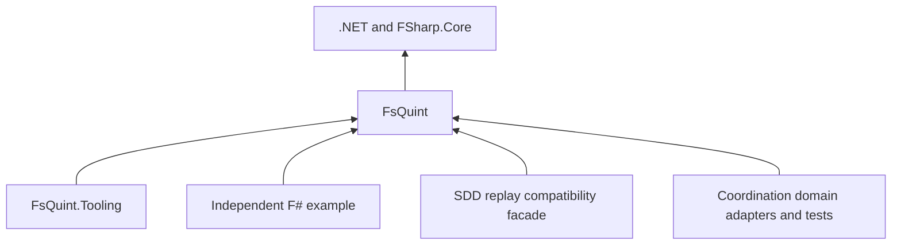

# FsQuint: reusable Quint–F# correspondence

Feature identity: **FSQUINT-01**

Date: **2026-09-18**

Status: **implementation active; FQ0–FQ6 complete; update and stable-release qualification active**

Repository: **FS-GG/FsQuint**, public. Core and Tooling 0.1.0 are published; final consumer qualification is in progress.

Planning owner: FS-GG; implementation/package owner: FsQuint maintainers.

Consumers: an independent F# example, FS.GG.Coordination, and the applicable FS.GG.SDD replay surface.

## 1. Outcome and scope

An ordinary F# project can consume a public NuGet package, generate or load genuine Quint ITF traces,
drive its own implementation, and receive a useful first-divergence report. It needs no FS-GG repository
layout, SDD lifecycle, private feed, GitHub organization membership, Akka, PostgreSQL or installed service.
FsQuint owns the reusable integration once; consumers obtain fixes through versioned dependencies and
qualified update PRs. No source-vendoring or downstream generic replay forks are the steady state.

The original design was planning-only. The subsequent user instruction authorizes completing this
roadmap and making implementation/release decisions; installed operational adoption remains separate.
Merging the design records the plan, not completion of any implementation milestone. The unified V2 critical
path, GS2 acceptance, OpenV2, Q4 and installed O3 follow-up keep their existing boundaries.

The first useful release supplies trace decoding, validation, replay and comparison plus an optional
process runner. It does not translate arbitrary F# into Quint, prove arbitrary application correctness,
implement a new model checker, provide a production workflow engine, or replace domain-owned models.
Fable/browser execution, C# convenience APIs, test-framework plugins, automatic counterexample shrinking,
remote execution, generic Choreo adapters and additional verifier backends are later demand-led options.

## 2. Existing implementation and extraction evidence

Use these inspected snapshots as extraction inputs; recheck current owners and heads before implementation.

| Source | Existing capability | Extraction consequence |
|---|---|---|
| [SDD QuintReplay.fs](https://github.com/FS-GG/FS.GG.SDD/blob/7013aa1915a37c341107fcf9a66f87f3f73cc8c8/src/FS.GG.SDD.Artifacts/TypedSpecifications/QuintReplay.fs) and [public signatures](https://github.com/FS-GG/FS.GG.SDD/blob/7013aa1915a37c341107fcf9a66f87f3f73cc8c8/src/FS.GG.SDD.Artifacts/TypedSpecifications/QuintReplay.fsi) | Runtime-neutral values, states, trace/environment identities, ITF decoding, canonical fingerprints, validation and comparison | Move the reusable implementation and its tests; account for existing public .NET type identity and serialized schema compatibility |
| [Coordination ReplayHarness.fs](https://github.com/FS-GG/FS.GG.Coordination/blob/8135bb68bac07e941897ec556568c52ade6a492c/tests/FS.GG.Coordination.QuintReplay.Tests/ReplayHarness.fs) | Generic Initialize/Apply/Observe driver over SDD replay types; currently linked as test source | Extract the engine, eliminate linked-source consumption and depend on the public package |
| [Coordination ChoreoTrace.fs](https://github.com/FS-GG/FS.GG.Coordination/blob/8135bb68bac07e941897ec556568c52ade6a492c/tests/FS.GG.Coordination.Orchestration.Host.Tests/ChoreoTrace.fs) | Raw Choreo parsing, exact source/tool pins, operation-envelope validation and milestone projection | Keep hosted-writer semantics and identity policy in Coordination; extract only genuinely generic decoding utilities |
| [Completed C0–C6 roadmap](https://github.com/FS-GG/FS.GG.Coordination/blob/8135bb68bac07e941897ec556568c52ade6a492c/docs/roadmaps/choreo-akka-fsharp-trace-correspondence.md) and [qualification decision](https://github.com/FS-GG/FS.GG.Coordination/blob/8135bb68bac07e941897ec556568c52ade6a492c/docs/architecture/choreo-qualification.md) | Eight raw traces, real Host/actor and PostgreSQL replay, negative controls, bounded formal and parity evidence | Production consumer regression corpus, not a claim that every external protocol is covered |

The existing value representation is not assumed to implement the complete ITF value space. Audit actual
upstream encodings, including maps, tuples, sets, arbitrary integers and variants, against exact tool versions.
Unsupported encodings must fail explicitly; do not reinterpret unknown tagged values as ordinary records.
The existing harness is a starting point, not an already supported public library.

The inspected SDD source carries an MIT license. Choreo's pinned source carries Apache-2.0 notices.
Coordination extraction rights and attribution must be established explicitly before moving code; a common
organization owner is not a substitute for a license/provenance record. Proposed FsQuint license: MIT for
original and compatibly extracted code, retaining all applicable notices. FQ0 resolves any incompatible or
unclear source before redistribution. Example fixtures also need provenance and redistribution review.

## 3. Ownership and package boundaries

| FsQuint owns | Consumer owns |
|---|---|
| Supported ITF decoding and canonical value semantics | Quint specification, invariants, scenarios and fairness assumptions |
| Generic trace validation and fingerprints | Model/module/variable names, source provenance policy and accepted pins |
| Replay sequencing, cancellation and diagnostics | Driver that invokes the actual reducer, service, actor or external test seam |
| Strict observation comparison primitives | Domain projection, permitted milestone alignment and explicit equivalence rules |
| Optional process execution and structured tool outcomes | Budgets, test selection, tool provisioning policy and CI acceptance |
| Compatibility corpus and package API | Installed effects, application qualification and runtime adoption |

Start with two deliverable packages rather than a package per type:

- **FsQuint**: neutral values and trace types, bounded ITF reader, canonical encoding/fingerprints, validation,
  comparison and async replay. Dependencies should be the BCL and FSharp.Core unless an audited necessity
  is demonstrated. No FS.GG, test-framework, actor, database or process-tool dependency.
- **FsQuint.Tooling**: optional Quint invocation, explicit executable identity checks, bounded output,
  deadlines/cancellation and structured results. Depends on FsQuint, never the reverse. No bundled Quint,
  Java, Apalache or automatic download in the first release; callers provision exact tools separately.

SDD compiler/profile/literate-source and lifecycle functionality stays in SDD. A future integration adapter
belongs to SDD or a separate downstream package; it must not make FsQuint depend on SDD. General tool-running
logic may move only where SDD's supported behavior can delegate without losing its policy checks.

Arrows mean dependency. No edge points from FsQuint to a consumer. Production libraries need not reference
FsQuint: test projects can own the dependency. Raw models and application trace fixtures remain consumer assets.

## 4. Trace and value contract

Keep raw ITF distinct from the library's versioned replay envelope. Raw tool output is retained unchanged;
a replay envelope binds it to consumer-supplied action/source information, observations and provenance.
Do not infer an action name from adjacent states or invent a source binding when the tool did not supply it.
Missing metadata is either explicitly unknown under the selected mode or a validation error for a mode that
requires it. A state-only trace cannot silently become a fully attributed action replay.

The initial supported value matrix is defined from fixtures generated by the pinned Quint baseline, with
positive and negative examples for every claimed encoding. Preserve arbitrary-precision integers exactly;
never round through floating point. Distinguish sequence order, tuple arity, unordered set membership,
map key/value identity, records and variant tags. Reject duplicate object keys, malformed tagged values,
ambiguous normalization and unsupported encodings with an exact JSON path. Define canonical ordering once,
independent of locale and source enumeration order; do not confuse a map with a string-keyed record.

The reader accepts caller-selected maximum input bytes, nesting, states and collection sizes with safe
finite defaults. Reject invalid UTF-8/JSON, impossible indices, duplicate bindings, identity mismatches and
truncated output. No expression evaluation, dynamic type loading, network fetch or filesystem write occurs
while decoding. Source paths are diagnostic data, not permission to open arbitrary files.

The replay envelope records schema/canonicalization versions, model/raw-trace digests, scenario, seed and
bounds, tool identity, projection identity and relevant implementation identity. Distinguish library producer
version from semantic identity: consumer evidence policy decides which changes invalidate reuse, but a
change to decoding, comparison, projection, tool or canonicalization cannot silently reuse old conformance.
Separate raw bytes, normalized representation and application observations so each claim is inspectable.
Hashes establish integrity and identity, not authenticity, authorization or proof of correctness.

## 5. Replay and comparison behavior

The public API is F#-first, with explicit signatures and structured result types. The design retains the
Initialize/Apply/Observe division; final names and generic parameters are frozen only after both consumer
spikes. Cancellation and cleanup are part of the driver lifecycle, not optional test-suite folklore.

1. Validate the complete trace and required provenance before any driver action.
2. Initialize an isolated test implementation and compare its initial observation.
3. Apply each selected action once through the real implementation, then observe it at the declared boundary.
4. Compare model-observable values and return the first mismatch with raw state/step, action and source
   information when available, expected/actual values and a structured difference path.
5. Release resources on success, mismatch, driver error, timeout or cancellation.

Distinguish Equivalent, Diverged, InvalidTrace, DriverFailure, Cancelled, TimedOut and UnsupportedInput.
A normal return from a tool or driver does not imply equivalence. Cleanup failure must be reported without
hiding the original failure. Do not automatically retry Apply: it may have an effect whose outcome is unknown.
The generic engine cannot guarantee termination of arbitrary in-process user code. Require cooperative
cancellation, and use an isolated worker process when a hard deadline is part of the claim.

Strict comparison is the default. Domain projections must be explicit, versioned and independently tested.
Milestone comparison may coalesce declared internal steps, but retains raw indices and checks every required
boundary. It must not ignore unexpected observations, drop terminal checks or accept arbitrary subsequences.
No built-in policy treats unknown as absent, absence as completion, or duplicate input as harmless.
Application adapters decide allowed facts; their negative controls establish that the projection is not
permissive. FsQuint neither implements the domain transition function nor makes a fake provider authoritative.

A trace match proves agreement for that trace and projection. Random samples are not exhaustive verification;
bounded model checking states its bounds; temporal results retain fairness/environment assumptions.
FsQuint does not infer unbounded refinement, bisimulation or proof of external infrastructure from replay.

## 6. Optional tooling and reproducibility

FsQuint.Tooling receives an explicit executable path, expected version/digest where required, working
directory, source/module/action selection, seed, backend and limits. Invoke through argument arrays, never
shell interpolation. Specify environment changes explicitly without dumping secrets into diagnostics.
Resolve tool identities before execution. Provisioning stays caller-owned, enabling offline and private CI.

Separate launch failure, unsupported version, parse/type error, simulation result, counterexample, completed
bounded verification, timeout, cancellation and incomplete/unknown result. Exit code zero alone is insufficient
for a verified result. Check expected output and result evidence; a named-test request that runs no tests fails.
Version-specific output interpretation is covered by captured and freshly generated tool fixtures.

Enforce output limits and deadlines; terminate the owned process tree and wait for cleanup where the platform
supports it. Use isolated working directories and verifier endpoints. Do not terminate unrelated processes.
Any infrastructure retry is explicit, bounded, reported, and restricted to recognized startup failures;
never retry away a counterexample or turn a missing result into success. Platform behavior must be tested,
and unsupported hard-containment behavior disclosed rather than promised.

Core packages have no tool-install side effects. First-release tooling qualification targets Linux x64 with
Quint 0.32.0 as the existing extraction baseline. FQ0/FQ3 confirm available distributions and backend support;
other combinations remain unsupported until tested. Core portability and tooling platform support are
separate claims. A caller may generate traces elsewhere and replay them without installing Quint locally.

## 7. Compatibility and release policy

Maintain independent version axes: NuGet API, replay schema/canonicalization, supported raw ITF dialect,
Quint CLI/backend, and consumer adapter/projection. Publish a tested compatibility matrix including .NET TFMs,
FSharp.Core floor, OS/architecture and verifier requirements where relevant. The user explicitly selected current .NET 10: net10.0, SDK 10.0.401, FSharp.Core 10.1.302.
This is an explicit product requirement, independently exercised by the clean queue consumer.
Fable support is deferred until the JSON, cryptography and async dependencies have their own qualification.

Use explicit package versions and lock files in qualified consumers. Stable releases follow semantic
versioning; document prerelease instability. Preserve existing trace fingerprints during extraction where
semantics are unchanged. An unavoidable canonicalization/schema change gets a new identity and migration
policy, not overwritten historical fixtures or receipts. A diagnostic wording change can retain a stable
machine code; acceptance must not depend on incidental log prose.

SDD's public records/unions and namespace are compatibility-sensitive. Moving an F# type to a new assembly
or using a source alias is not automatically binary compatible. Prefer a temporary SDD facade retaining its
public types and converting losslessly to FsQuint, delegating all generic algorithms. Prove mapping round
trips and previous-consumer compatibility. Use actual CLR forwarding only if exact identity feasibility is
established. Otherwise use a documented major-version transition. The facade owns translation only: no
second decoder, canonicalizer, validator or comparator. Track its retirement condition explicitly.

Publish public packages to nuget.org so anonymous consumers need no organizational credentials. Optional
mirroring follows the owner's release policy and must preserve identical archive bytes. Verify clean restore
from the served package, symbols/XML docs, license/readme/source provenance and dependency closure before
claiming availability. Never overwrite a published version; package/API names are checked and reserved only
under an explicit repository/release action. Select a prerelease for migration, then promote a stable version
only after the independent and production consumers pass against public immutable packages.

## 8. Extraction and downstream propagation

Use one upstream implementation and a staged dependency transition:

1. Inventory reusable source, tests, public APIs, licenses and consumers at immutable revisions.
2. Move generic behavior and its regression corpus to FsQuint with attribution; keep consumer semantics local.
3. Publish an extraction prerelease after independent qualification.
4. Change SDD to delegate through that package while preserving its supported API/schema boundary.
5. Change Coordination to package references, removing the linked generic ReplayHarness source and any generic
   decoding/comparison code now owned by FsQuint. Retain its model, manifest, operation-envelope guards,
   production adapters and budgets. Do not remove SDD dependencies that still serve unrelated functionality.
6. Run existing evidence before deleting compatibility paths; complete the migration with a final duplicate-code
   and dependency-direction audit. No permanent copied implementation remains in either consumer.

A short-lived source snapshot may exist while extraction is reviewed, but production ownership remains with
its original owner until the package transition. Name one extraction owner, keep a bounded migration window,
and port every intervening generic fix upstream before consumer cutover. A migration inventory records each
source symbol/file as moved, consumer-specific, compatibility mapping or deferred with an owner and reason.
It is a temporary extraction aid, not a new permanent delivery ledger.

After migration, generic defects are fixed and regression-tested upstream first. Release notes identify
behavioral/evidence impacts. Dependency automation opens pinned update PRs in SDD and Coordination; their
actual trace/replay and relevant formal gates determine adoption. Approved compatible updates may auto-merge
under each repository's policy. Breaking changes, parser support expansion and tool upgrades receive explicit
compatibility review. No consumer upgrades at runtime, follows a floating version or accepts new golden files
merely because the library produced them.

Updating FsQuint does not automatically update Quint. Test supported library/tool combinations separately.
Bind relevant package/tool/projection/input identities into consumer reuse; invalidation tests must detect
changes in fixtures, scripts and retained counterexamples. Keep positive controls for unrelated changes.
A failed update stays pinned while the regression is diagnosed. Roll back by selecting the prior immutable
package and compatible evidence, never by hiding a failure or reconstructing a downstream fork.

## 9. Examples, tests and documentation

The independent example should be a small deterministic bounded queue or reservation state machine with
an independently written F# implementation. Keep its ordinary Quint source visible and generated raw traces
reproducible. Include an intentional implementation defect, a malformed trace and a projection mutation;
each must fail at the expected boundary. It must restore/build/test outside an FS-GG checkout with only public
package access and documented tools. No inherited org build imports, private configuration or GitHub Actions
service is needed. The example may live in FsQuint, but its external-consumer test copies only documented
example assets into a clean directory and consumes the served package, not a project reference.

Coordination supplies the second, production consumer. Preserve all eight raw Choreo fixtures and their
source provenance, memory/PostgreSQL replay, negative controls, legacy parity and complete canonical
qualification where affected. Its 64-state progress and 1,162-state bounded fault evidence remain scoped to
its model; these numbers are not universal library limits. Keep the installed O3 fix-adoption operation separate.

Test layers include value/decoder rejection and resource limits; canonicalization determinism; initial,
intermediate and terminal divergence; missing/extra observations; driver failure/cancellation/cleanup;
process output/deadline behavior; previous schema/API compatibility; public package restore; and consumer
regression. Property tests supplement independent hand-reviewed cases rather than using one implementation
as both producer and oracle. Cover line endings, Unicode, culture and arbitrary integer magnitudes.

Documentation explains the evidence model before the API, then an independent getting-started journey,
domain driver/projection design, actual trace generation, negative controls, first-divergence triage,
compatibility and migration, offline use and contribution/release policy. Clearly distinguish generation,
model checking and implementation replay. Commands and examples are tested before publication.

## 10. Delivery roadmap

Checkboxes below concern this proposed implementation and are intentionally unchecked. Repository ownership
below is prospective until FQ0 establishes it. Each milestone has a useful review boundary; do not prescribe
a PR per checkbox. Use ordinary repository delivery with required checks and separate publication/adoption
authority. Reuse existing evidence instead of restarting the completed Choreo programme.

| Milestone | Owner and prerequisites | Deliverable and acceptance |
|---|---|---|
| **FQ0 — Establish extraction contract** | FsQuint planning owner with SDD and Coordination maintainers | Confirm public repository/package names, licensing/attribution, source and consumer inventory, TFM/tool support, package/API boundary and SDD compatibility strategy. Resolve rights and dependency cycles before copying or publication. Record a bounded migration window and accountable release/maintenance owner |
| **FQ1 — Create the public core** | FsQuint; FQ0 | Create the repository and generic core, move audited value/trace/validation/comparison behavior with tests, and document supported ITF encodings. Deterministic fingerprints, malformed-input rejection, finite parser limits and zero consumer dependencies pass. Existing compatibility corpus retains its identities or an explicit versioned migration explains every difference |
| **FQ2 — Extract replay and prove independence** | FsQuint; FQ1 | Move the driver engine and diagnostics; implement resource lifecycle and explicit result semantics. Independent F# example proves valid agreement and intended failures from a clean external directory, initially against a locally packed candidate. No FS.GG infrastructure or domain assumptions are required |
| **FQ3 — Qualify optional tooling** | FsQuint; FQ1; may overlap FQ2 after interfaces settle | Implement the optional process wrapper for the declared Quint/backend/platform matrix. Prove explicit identity selection, real scenario counts, malformed/empty output refusal, bounded owned-process cleanup and offline-provisioned operation. Core replay remains usable without installed tools |
| **FQ4 — Publish extraction prerelease** | FsQuint release owner; FQ2 and FQ3 | Under release authority, publish immutable public packages and verify served archive identity, anonymous clean install, dependency closure, docs and example execution. Record API/schema/tool compatibility and known limits. No stable/general-availability claim yet |
| **FQ5 — Migrate SDD without parallel algorithms** | SDD owner; FQ4 | Replace generic replay implementation with package delegation and any required compatibility mapping. Previous public API/schema consumers and canonical fingerprints pass; generic algorithm copies are removed. Publish the needed SDD version through its existing release process before a consumer requires it |
| **FQ6 — Migrate Coordination and prove correspondence** | Coordination owner; FQ4 and FQ5 where SDD compatibility is needed | Consume packages, delete linked generic harness/duplicate algorithms, retain domain guards and raw fixtures. Run production memory/PostgreSQL replay, mutation controls and affected canonical/parity gates. Complete the source-ownership audit; no runtime activation is implied |
| **FQ7 — Qualify updates and stable release** | FsQuint and both consumer owners; FQ5–FQ6 | Exercise one substantive generic bug fix through a package update and both consumer PRs, plus a rejected incompatible/evidence-changing update. Verify package/tool pin separation, cache invalidation and rollback. Publish a stable version under release authority, rerun public independent and production consumer evidence against its served bytes, and establish maintenance/support ownership |

- [x] FQ0 extraction, rights and compatibility decisions accepted; see [decisions](../decisions.md).
- [x] FQ1 generic core and decoder/value contract qualified.
- [x] FQ2 independent example and production-driver interface qualified.
- [x] FQ3 optional tooling matrix and failure behavior qualified.
- [x] FQ4 immutable public prerelease installed anonymously.
- [x] FQ5 SDD delegates without duplicate generic algorithms.
- [x] FQ6 Coordination consumes packages with existing evidence preserved.
- [ ] FQ7 actual downstream update, rollback and stable public consumption qualified.

FQ2 and FQ3 can develop in parallel once shared interfaces stabilize; FQ5 and domain migration preparation
can overlap without publishing consumers against unavailable packages. Stable release follows both consumers.
If tooling cannot meet its declared support boundary, explicitly reduce the release claim through a design
revision rather than silently omit FQ3. Do not block core experiments on speculative platform coverage.

## 11. Risks and decisions that must remain explicit

| Risk | Response and exit evidence |
|---|---|
| Generic API is merely the hosted-writer API renamed | Independent queue/reservation example passes before consumer migration; no hard-coded process, operation or repository names in core |
| Existing replay types move and break binary consumers | FQ0 selects tested facade/forwarding/major-version strategy; FQ5 compiles and runs previous consumer fixtures |
| Canonicalization makes an old trace appear valid with changed meaning | Version semantic identity; preserve raw bytes and independently verify schema migrations |
| Projection hides a real implementation defect | Mutate observations, identities and terminal behavior; expected divergence must survive projection |
| Package migration creates circular dependencies | Automated package/project graph check rejects FsQuint-to-SDD/Coordination edges |
| Generic fixes diverge during extraction | Single upstream owner and bounded transition; final duplicate-code audit and real downstream update exercise |
| Parser or process consumes unbounded resources | Finite input/output limits, malicious fixture corpus and platform-qualified process containment |
| Green result is vacuous or verifier exits early | Assert actual named scenario execution and supported result evidence; incomplete work cannot report pass |
| Public package secretly needs organizational infrastructure | Anonymous external-directory restore/build/test using served packages and declared tools only |
| Attractive library extraction delays V2 or installed fixes | Separate ownership and scheduling; no new V2 gate and no suspension of existing operational follow-up |
| License/provenance is assumed from repository ownership | Audit each moved source/fixture before redistribution; preserve notices or replace unclear material lawfully |

## 12. Completion, maintenance and continuation

The programme is complete when public stable packages serve an independent F# consumer and Coordination;
SDD delegates its applicable generic replay behavior; generic algorithms have one owner; and a real upstream
fix has propagated through tested consumer updates. Source merge, local packing, prerelease publication and
installed operational adoption are distinct outcomes. No throughput or cost-saving percentage is promised.
Measure migration/maintenance effort, package footprint, replay overhead and consumer-update delay before
claiming improvement; correctness and removal of duplicate ownership are the initial goals.

FsQuint maintainers own public API/schema compatibility, tool matrix, release integrity and security intake.
Consumers own their models, projections, effects and adoption decisions. Document issue triage and supported
version policy at stable release; do not invent an organizational service commitment here. Review upstream
Quint changes before extending support and keep unsupported inputs explicit. Choreo remains an optional
example dependency under its own license/pin, not a runtime requirement or an automatic fleet rollout.

On continuation, inspect the first incomplete milestone and current upstream/consumer heads, verify its
prerequisites, and execute the next useful bounded slice. Update this roadmap with actual merge/release and
consumer evidence. After repository creation, FsQuint owns the detailed implementation plan; keep one
canonical roadmap or a clear successor link here rather than maintaining divergent progress ledgers.

## Implementation evidence — 2026-09-18

FQ0–FQ3: net10.0, SDK 10.0.401; 65 core/tooling checks and an external-directory
package consumer pass. Original SDD canonical byte/fingerprint vectors are retained
in `tests/legacy-vectors.json`; generated from the attributed source revision, with
no source copy in the test suite. Genuine queue traces include agreement, deliberate
FIFO and projection divergence; raw map/tuple/set/bigint/variant fixtures come from
Quint 0.32.0. Process tests cover real named tests, zero tests, samples/counterexample,
identity mismatch, output flood, deadline and owned-child termination. The [tooling setup](../usage.md#reproducing-the-linux-tooling-checks) provisions both
Quint and its Rust evaluator before the full local check.

The tooling scope is explicitly narrowed to typecheck/test/run in [decisions](../decisions.md).
No verifier outcome is exposed. Existing consumer formal gates remain unchanged.

NuGet trust was initially missing; the owner configured FS-Quint-Publishing, and
[identity check 35319107544](https://github.com/FS-GG/FsQuint/actions/runs/35319107544)
succeeded. This is authentication evidence only, not a publication receipt.

Migration spikes: SDD's existing seven replay tests pass through the facade; Coordination's
78 Host tests pass after removing the linked engine and using the package driver API.
These are local candidate checks, not completion of FQ5/FQ6 public consumption.

FQ4: both preview packages and symbols were pushed by
[release 35319721519](https://github.com/FS-GG/FsQuint/actions/runs/35319721519).
Its post-push readback failed on an HTTP redirect. PR3 repaired credential handling;
[read-only recovery 35320082755](https://github.com/FS-GG/FsQuint/actions/runs/35320082755)
verified matching served payloads, immutable tag source identity and a clean anonymous
queue consumer. No published version or tag was replaced.

FQ7 upstream defect reproduced against served preview 1: an unpaired UTF-16 surrogate
was accepted and fingerprinted identically to U+FFFD through UTF-8 replacement fallback.
The regression fails on preview 1; the fix rejects malformed strings across text, record
keys, state bindings and trace provenance. Valid Unicode/canonical identities are unchanged.
Preview 2 carries the fix. Stable 0.1.0 is now publicly verified; final downstream stable adoption remains outstanding.

Consumer qualification: SDD [PR996](https://github.com/FS-GG/FS.GG.SDD/pull/996)
merged with unchanged public signatures and compiled-client compatibility. Its public
preview release passed [read-only recovery 35324708073](https://github.com/FS-GG/FS.GG.SDD/actions/runs/35324708073),
including both-feed source/payload identity and clean installs. An unchanged client
compiled against public SDD 2.0.1 also runs against the served 2.0.2-preview.1 assembly. [PR997](https://github.com/FS-GG/FS.GG.SDD/pull/997)
merged the preview 2 update after CI; 635 artifact and 1,355 command tests also pass locally. A deliberate
preview 1 downgrade fails the new regression; restoring preview 2 passes all eight
replay tests. No observations or tool pins change.

Coordination [PR429](https://github.com/FS-GG/FS.GG.Coordination/pull/429) has local
Host 78, PostgreSQL 34, architecture 657 and complete canonical qualification: Q1/Q2,
eight positive invariants, 166 negative controls, 64 hosted progress states and 1,162
hosted fault-safety states. Compiler/protocol identities and budgets are unchanged.
The initial migration merged after all required CI gates passed. The subsequent
[preview 2 update PR431](https://github.com/FS-GG/FS.GG.Coordination/pull/431) merged after its gates passed and passes journal 3, Host 78 and PostgreSQL 34 locally; a preview 1 downgrade is
rejected, and rollback to preview 2 passes the three journal controls.

The queue example and Coordination currently reference only core. Tooling is optional
and independently qualified by real process tests; no consumer reference is invented
merely to exercise a package dependency. Registry ownership and support policy are
recorded in [.github PR3537](https://github.com/FS-GG/.github/pull/3537).

Update automation: Coordination [PR432](https://github.com/FS-GG/FS.GG.Coordination/pull/432)
adds a digest-bound current updater inventory while retaining the original GS2 corpus
and seal. Renovate 44.99.0 detects the central FsQuint pin; eight architecture checks
include five new policy-weakening mutations and the existing alternate-route controls.
SDD already has the organization preset; its stable adoption explicitly routes FsQuint
to public NuGet and disables automatic merging. A real extraction scan exposed its
obsolete private-feed secret interpolation, which is removed with that adoption.

Stable publication: [PR9](https://github.com/FS-GG/FsQuint/pull/9) merged at
`34eeca981c136144ced73a3f98b5ce04218e89c7`; immutable tag `v0.1.0` publishes both
packages and symbols. [Release verification](https://github.com/FS-GG/FsQuint/actions/runs/35330871321)
passed both-feed payload/source readback and the anonymous independent queue example.
CI explicitly provisions checksum-pinned Quint 0.32.0 and Rust evaluator 0.6.0,
avoiding an implicit evaluator download that exposed a GitHub API 403 during qualification.
All 73 core/tooling checks pass with the explicitly provisioned toolchain.

Final adoption is tracked by SDD [PR998](https://github.com/FS-GG/FS.GG.SDD/pull/998),
Coordination [PR432](https://github.com/FS-GG/FS.GG.Coordination/pull/432), and the
[stable registry update](https://github.com/FS-GG/.github/pull/3540). Local SDD
635 artifact and 1,355 command tests pass against served stable bytes; Coordination
Host 78, PostgreSQL 34 and journal 3 also pass. FQ7 stays open until these final
consumer changes and the coherent SDD stable release finish.
